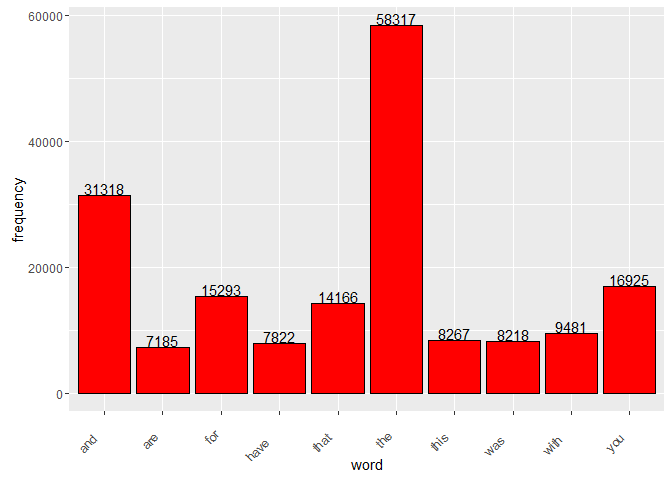
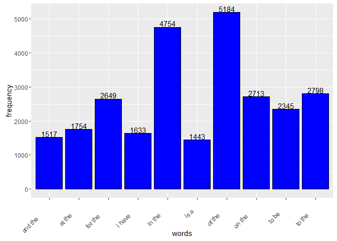
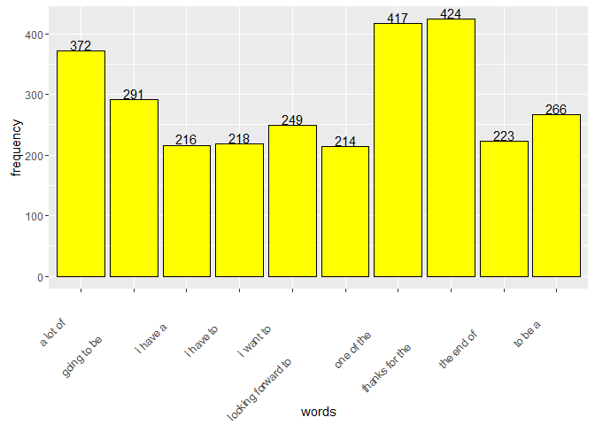

# 


## Milestone Report for SwiftKey Project

Lau Heng Kar

March 19, 2016 (Data Science Capstone Project)

## Introduction

The goal of this project is just to display that you've gotten used to working with the data and that you are on track to create your prediction algorithm. Please submit a report on R Pubs (http://rpubs.com/) that explains your exploratory analysis and your goals for the eventual app and algorithm. This document should be concise and explain only the major features of the data you have identified and briefly summarize your plans for creating the prediction algorithm and Shiny app in a way that would be understandable to a non-data scientist manager. You should make use of tables and plots to illustrate important summaries of the data set. 

The motivation for this project is to: 

1. Demonstrate that you've downloaded the data and have successfully loaded it in.
2. Create a basic report of summary statistics about the data sets.
3. Report any interesting findings that you amassed so far.
4. Get feedback on your plans for creating a prediction algorithm and Shiny app.

In this report we look at three corpora of US English text, a set of internet blogs posts, a set of internet news articles, and a set of twitter messages.

## Data Downloaded And Successfully Loaded

The course dataset for this capstone project are available here:

https://d396qusza40orc.cloudfront.net/dsscapstone/dataset/Coursera-SwiftKey.zip


```r
downloadData <- function() {
    # if training file is not exist, then download from web
    if (!file.exists("Coursera-SwiftKey.zip")) {
        fileURL <- "https://d396qusza40orc.cloudfront.net/dsscapstone/dataset/Coursera-SwiftKey.zip"
        download.file(fileURL, destfile=("Coursera-SwiftKey.zip"))
        list.files(".")
    }
    
    unzip("Coursera-SwiftKey.zip")
}

# Step 1: Download and Loading Data
downloadData()
twitter <- readLines("./final/en_US/en_US.twitter.txt", encoding = "UTF-8", skipNul = TRUE)
blogs <- readLines("./final/en_US/en_US.blogs.txt", encoding = "UTF-8", skipNul = TRUE)
news <- readLines("./final/en_US/en_US.news.txt", encoding = "UTF-8", skipNul = TRUE, warn = FALSE)

# Convert UTF-8 to ASCII
twitter <- iconv(twitter, 'UTF-8', 'ASCII', "byte")
blogs <- iconv(blogs, 'UTF-8', 'ASCII', "byte")
news <- iconv(news, 'UTF-8', 'ASCII', "byte")
```

## Summary Statistics about the data sets


```r
# Step 2: file list
list.files("./final")
list.files("./final/en_US/")

# Step 2: file size
blogs.filesizeMB <- file.info("./final/en_US/en_US.blogs.txt")$size/1024/1000
news.filesizeMB <- file.info("./final/en_US/en_US.news.txt")$size/1024/1000
twitter.filesizeMB <- file.info("./final/en_US/en_US.twitter.txt")$size/1024/1000

# Step 2: show head and tail
head(twitter, 3)
tail(twitter, 3)

head(blogs, 3)
tail(blogs, 3)

head(news, 3)
tail(news, 3)

# Step 2: words count and length of the longest line seen
blogs.wordsCount <- nchar(blogs)
tmax <- which.max(blogs.wordsCount)
blogs.longestWordCount <- nchar(blogs[tmax])

news.wordsCount <- nchar(news)
tmax <- which.max(news.wordsCount)
news.longestWordCount <- nchar(news[tmax])

twitter.wordsCount <- nchar(twitter)
tmax <- which.max(twitter.wordsCount)
twitter.longestWordCount <- nchar(twitter[tmax])

# Step 2: combine as data frame
df.blogs <- c(blogs.filesizeMB, length(blogs.wordsCount), blogs.longestWordCount)
df.news <- c(news.filesizeMB, length(news.wordsCount), news.longestWordCount)
df.twitter <- c(twitter.filesizeMB, length(twitter.wordsCount), twitter.longestWordCount)

info <- data.frame(rbind(df.blogs, df.news, df.twitter))
names(info) <- c("File Size (MB)", "Word Count", "Longest Line")
row.names(info) <- c("blogs", "news", "twitter")
```

A summary for 3 dataset as shown below: blogs, news, and twitter.


```r
# Step 2: Show summary of 3 text files: blogs, news, and twitter
info
```

```
##         File Size (MB) Word Count Longest Line
## blogs         205.2344     899288        40833
## news          200.9882      77259         5760
## twitter       163.1888    2360148          140
```

## Corpus from sample

In order to be able to clean and manipulate the data, we will create a corpus, which will combined all three sample text files. Sample size of the text files is 2%.


```r
# load related library
require(tm)
require(SnowballC)
require(RWeka)
require(slam)
```

```
## Warning: package 'slam' was built under R version 3.2.3
```

```r
require(ggplot2)
```

```
## Warning: package 'ggplot2' was built under R version 3.2.3
```

```r
# Step 3: 
# Combine all twitter, blogs and news and save to RData
all <- c(twitter, blogs, news)
save(all, file="all.RData")

# Step 4: 
# To use 2% of the available data, which is around 80k and save to RData
all.sample <- sample(all, round(0.02*length(all)))
save(all.sample, file="sample-2p.RData")

# Step 5: 
# Clear memory
rm(all)
rm(news)
rm(blogs)
rm(twitter)
rm(news.wordsCount)
rm(blogs.wordsCount)
rm(twitter.wordsCount)
rm(news.filesizeMB)
rm(blogs.filesizeMB)
rm(twitter.filesizeMB)
rm(news.longestWordCount)
rm(blogs.longestWordCount)
rm(twitter.longestWordCount)
rm(df.blogs)
rm(df.news)
rm(df.twitter)
rm(tmax)
gc()

# Step 6: 
# Now we create the Corpus from it
# Identify appropriate tokens such as words, punctuation, and numbers and remove profanity words
corpus <- Corpus(VectorSource(all.sample))
corpus <- tm_map(corpus, removePunctuation)
corpus <- tm_map(corpus, removeNumbers)
corpus <- tm_map(corpus, tolower)
corpus <- tm_map(corpus, stripWhitespace)
corpus <- tm_map(corpus, PlainTextDocument)

# use Github to download a list of profanity words to filter out Link 
# https://github.com/shutterstock/List-of-Dirty-Naughty-Obscene-and-Otherwise-Bad-Words/blob/master/en
badwords <- read.delim("en", sep = ":", header = FALSE)
badwords <- badwords[,1]
corpus <- tm_map(corpus, removeWords, badwords)

# Step 7: 
# Save the corpus for quick loading.  This will be useful for the final product.
save(corpus, file="sampleCorpus.RData")
```

## NGram Tokenizer


```r
# Create a few n-gram functions use the RWeka library
unigram_token <- function(x)  NGramTokenizer(x, Weka_control(min = 1, max = 1))
bigram_token <- function(x)   NGramTokenizer(x, Weka_control(min = 2, max = 2))
trigram_token <- function(x)  NGramTokenizer(x, Weka_control(min = 3, max = 3))
```

## Unigram Analysis

The first analysis is a unigram analysis. This will show top 10 words in Unigram are frequently used and follow by chart using ggplot.


```r
# Create a few n-gram functions use the RWeka library
unigram <- TermDocumentMatrix(corpus, control=list(tokenize=unigram_token))
unigram.good <- rollup(unigram, 2, na.rm=TRUE, FUN = sum)

# sort with decreasing frequency
unigram.tf <- findFreqTerms(unigram.good, lowfreq = 3)
unigram.tf <- sort(rowSums(as.matrix(unigram.good[unigram.tf, ])), decreasing = TRUE)
unigram.tf <- data.frame(unigram.good=names(unigram.tf), frequency=unigram.tf)
names(unigram.tf) <- c("word", "frequency")
head(unigram.tf, 10)
```

```
##      word frequency
## the   the     58317
## and   and     31318
## you   you     16925
## for   for     15293
## that that     14166
## with with      9481
## this this      8267
## was   was      8218
## have have      7822
## are   are      7185
```

```r
# plot top 10 word frequency for unigram
g <- ggplot(data = head(unigram.tf, 10), aes(x = word, y = frequency))
g <- g + geom_bar(stat="Identity", fill="red", colour = "black")
g <- g + geom_text(aes(label=frequency), vjust=-0.1)
g <- g + theme(axis.text.x = element_text(angle = 45, hjust = 2))
g
```

<!-- -->

## Bigram Analysis

Bigrams analysis is two word combinations. This will show top 10 words in Bigram are frequently used and follow by chart using ggplot.


```r
# Create a few n-gram functions use the RWeka library
bigram <- TermDocumentMatrix(corpus, control=list(tokenize=bigram_token))
bigram.good <- rollup(bigram, 2, na.rm=TRUE, FUN = sum)

# sort with decreasing frequency
bigram.tf <- findFreqTerms(bigram.good, lowfreq = 3)
bigram.tf <- sort(rowSums(as.matrix(bigram.good[bigram.tf, ])), decreasing = TRUE)
bigram.tf <- data.frame(bigram.good=names(bigram.tf), frequency=bigram.tf)
names(bigram.tf) <- c("words", "frequency")
head(bigram.tf, 10)
```

```
##           words frequency
## of the   of the      5184
## in the   in the      4754
## to the   to the      2798
## on the   on the      2713
## for the for the      2649
## to be     to be      2345
## at the   at the      1754
## i have   i have      1633
## and the and the      1517
## is a       is a      1443
```

```r
# plot top 10 word frequency for bigram
g <- ggplot(data = head(bigram.tf, 10), aes(x = words, y = frequency))
g <- g + geom_bar(stat="Identity", fill="blue", colour = "black")
g <- g + geom_text(aes(label=frequency), vjust=-0.1)
g <- g + theme(axis.text.x = element_text(angle = 45, hjust = 2))
g
```

<!-- -->

## Trigram Analysis

Trigram analysis is three word combinations. This will show top 10 words in Trigram are frequently used and follow by chart using ggplot.


```r
# Create a few n-gram functions use the RWeka library
trigram <- TermDocumentMatrix(corpus, control=list(tokenize=trigram_token))
trigram.good <- rollup(trigram, 2, na.rm=TRUE, FUN = sum)

# sort with decreasing frequency
trigram.tf <- findFreqTerms(trigram.good, lowfreq = 3)
trigram.tf <- sort(rowSums(as.matrix(trigram.good[trigram.tf, ])), decreasing = TRUE)
trigram.tf <- data.frame(trigram.good=names(trigram.tf), frequency=trigram.tf)
names(trigram.tf) <- c("words", "frequency")
head(trigram.tf, 10)
```

```
##                                 words frequency
## thanks for the         thanks for the       424
## one of the                 one of the       417
## a lot of                     a lot of       372
## going to be               going to be       291
## to be a                       to be a       266
## i want to                   i want to       249
## the end of                 the end of       223
## i have to                   i have to       218
## i have a                     i have a       216
## looking forward to looking forward to       214
```

```r
# plot top 10 word frequency for trigram
g <- ggplot(data = head(trigram.tf, 10), aes(x = words, y = frequency))
g <- g + geom_bar(stat="Identity", fill="yellow", colour = "black")
g <- g + geom_text(aes(label=frequency), vjust=-0.1)
g <- g + theme(axis.text.x = element_text(angle = 45, hjust = 2))
g
```

<!-- -->

## Plans for creating a prediction algorithm and Shiny app

The objective of this report was to build a simple model for the relationship between words before building a predictive text mining application. Next step is to explore simple models and discover more complicated modeling techniques in future to create the prediction algorithm and Shiny app for word prediction.

We will use the Ngram dataframes created here to calculate the probability of the next word occuring. The input string will be tokenized and the last 2 (or 1 if it's a unigram) words will be isolated and cross checked against the data frames to get the highest probability of next word.

