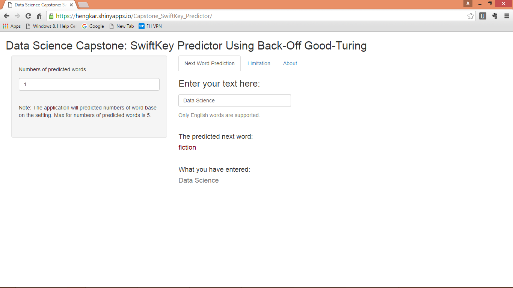

Data Science Capstone: SwiftKey Predictor Using Back-Off Good-Turing
========================================================
author: Heng Kar
date: 23 April 2016

*An [application](https://hengkar.shinyapps.io/Capstone_SwiftKey_Predictor/) that predicting the next word.*

Overview
========================================================

The main goal is to build a shiny application that consisting of a custom Natural Language Processing (NLP) model to predict the most probable next word to be typed, based upon analysis of a large corpus of raw text. 

The tasks are:

- Understanding the problem
- Data acquisition and cleaning
- Exploratory analysis
- Statistical modeling
- Predictive modeling

Model Training
========================================================

This project is started with by analyzing a large corpus of text documents which is prepared from 3 raw text files, sourced from blogs, Twitter, and news, that is approximately 560MB in total. 

2% of data set was sampled, cleaned, analyzed, tokenized, and n-gramified using a custom process into unigram, bigrams and trigrams. 

A hashing algorithm was used to translate contextual n-grams into large integers for the prediction matrix. The probabilities of each n-gram were calculated based upon their frequency.

Model Prediction
========================================================

A prediction algorithm was developed based upon the Back-Off Good-Turing model, where the probability of a word is estimated based upon the context of preceding words. 

|              |trigram       | freq|bigram    |name |
|:-------------|:-------------|----:|:---------|:----|
|cant wait see |cant wait see |   61|cant wait |see  |
|let us know   |let us know   |   45|let us    |know |

|          |bigram    | freq|unigram |name |
|:---------|:---------|----:|:-------|:----|
|right now |right now |  421|right   |now  |
|cant wait |cant wait |  337|cant    |wait |

|     |unigram | freq|
|:----|:-------|----:|
|just |just    | 5112|
|like |like    | 4331|

Details of Application
========================================================

Shiny App Next Word Prediction Screen Shot

***

The input text is passed to prediction function. Function returns table of next-word predictions and their probabilities.

URL

- [Shiny Application](https://hengkar.shinyapps.io/Capstone_SwiftKey_Predictor/)

- [GitHub Pitch Presentation](http://htmlpreview.github.io/?https://github.com/hengkar/Data_Science_Capstone-SwiftKey/blob/master/CapstoneSwiftKeyPredictor.html)

- [GitHub Source Code](https://github.com/hengkar/Data_Science_Capstone-SwiftKey)

